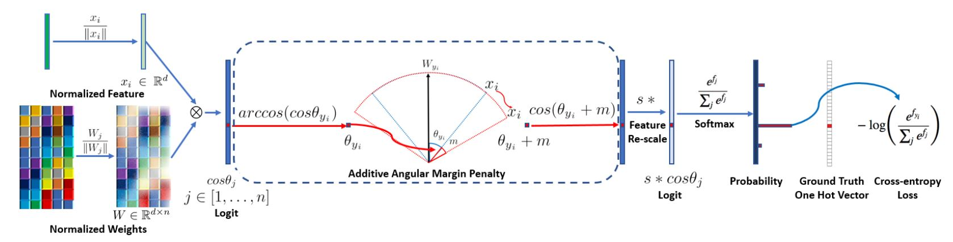
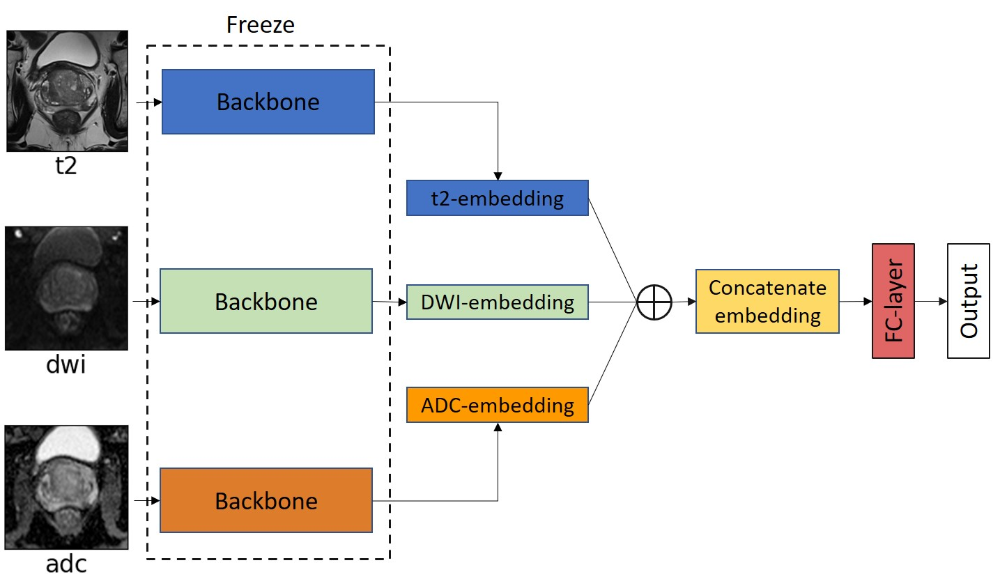
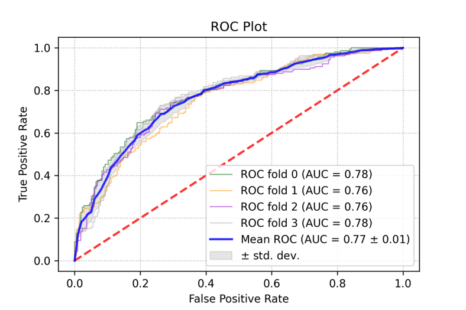
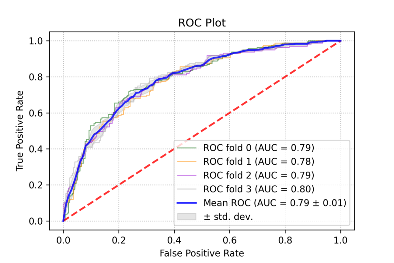
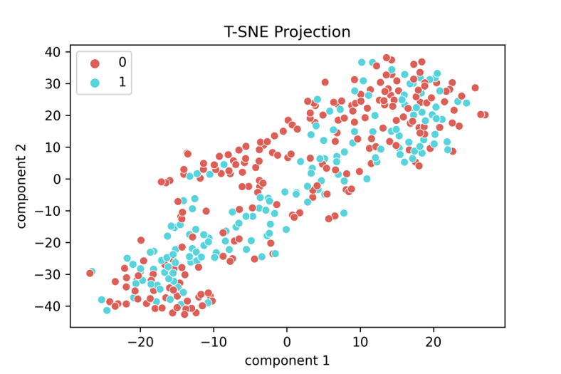
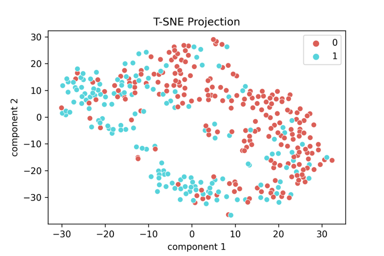
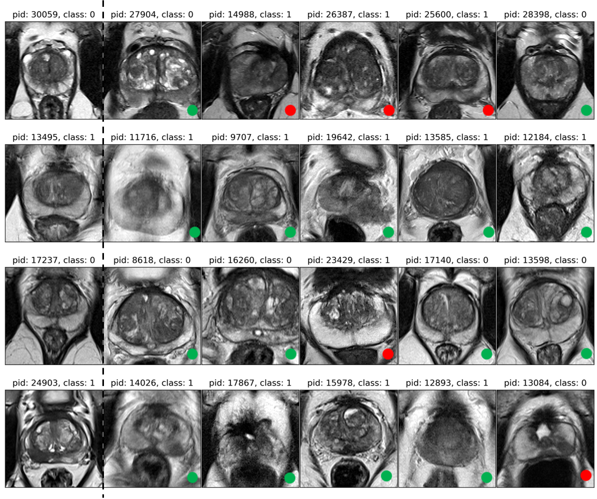

# Classification of Clinically Significant Prostate Cancer with Multiparametric MRI

Implementation of master thesis entitled "Classification of Clinically Significant Prostate Cancer with Multiparametric MRI", using deep metric learning method, specifically margin-based softmax loss ([ArcFace Loss](https://arxiv.org/abs/1801.07698)) for discriminative learning to reduce false positive for prostate patients biopsy. Suboptimally, similarity distance learnt by margin-based softmax loss will be extended to content based image retrieval for visual similarity task. 

 

## Experiment Setup 

### Backbone Model
The backbone model is a 3D classification model, Resnet10, an extension of 3D classification model zoo from [ZFTurbo](https://github.com/ZFTurbo/classification_models_3D). Or simply `pip install classification-models-3D`. 

### ArcFace Loss 

 

Adapted margin-based softmax loss can be found in `metric_loss.py`. Illustration of the implementation of ArcFace loss is as depcited above ([Image Source](https://github.com/deepinsight/insightface/tree/master/recognition)).

### Late Fusion

 

Three prostate MRI image sequences (T2, DWI, ADC) are provided in the data set.
While it is common practice to liaise the image sequences as channel input for richer
data features, however, it is not possible for all three image sequences to have the
same alignment due to constraints. We hypothesise that each image sequence would
contribute to different representations in the embedding space, by opting to feed
the network on each image sequence respectively. The embedding output of three
image sequences is concatenated forming an ensemble embedding that would enrich
the embedding space. This form a late fusion where the concatenated embedding is
connected to a fully connected network with a dimension size of 128 associating with
a dropout layer before connecting to output layer.

## Repo Structure
* Data granularity of the data set can be found in the folder `/eda`
* The source code for models training can be found in the folder `/train`
* Inferencing of the models can be found in the folder `/inference` 
* The configurations for training and inferencing with cross validation in `.yaml` are listed in `/sweep`
* Download dependencies `$ pip install --r requirements.txt`

## Results 
### Classification Task 
|Baseline|ArcFace|
|:--:|:--:|
|||

|       | AUC    |Accuracy| Precision| Recall | F1|
| :-----------: | :----------: | :-----------: | :-----------: |:-----------: | :-----------: |
| Baseline  | 0.77 (0.01)  | 0.71 (0.02) | 0.72 (0.02) | 0.71 (0.02) | 0.70 (0.03)|
| ArcFace  | 0.79 (0.01)  | 0.73 (0.01) | 0.73 (0.02) | 0.73 (0.01) | 0.72 (0.01)|

### Retrieval Task 
|Baseline|ArcFace|
|:--:|:--:|
|||

|       | R@1    | R@10_Precision| MAP@10| 
| :-----------: | :----------: | :-----------: | :-----------: |
| Baseline  | 0.57 (0.02)  | 0.58 (0.02) | 0.43 (0.02) |
| ArcFace  | 0.65 (0.02)  | 0.64 (0.02) | 0.51 (0.03) |

### Content Based Image Retrieval (CBIR)

Content-based Image Retrieval (CBIR) attempts to utilise image as a query to retrieve
images from the image database in replacement of keywords for more efficient retrieval
process. In this work, we first map volumetric images to
low dimensional embedding space, where the similarity scores between each query
embedding and retrieval embedding are computed. The nearest neighbour of the
query embedding are ranked according to the similarity scores in descending order.
While it is not trivial to visualise volumetric data and its retrieved images, the mid
slice of every patients’ MRI images are chosen to be displayed for CBIR task with the
assumption that the mid image slice contains the most significant image description
for a patient’s prostate. 

 

## Individual Contributions

Presents work that implements margin-based softmax loss on 3D medical imaging for classification and retrieval task. The work hypothesised that through the use
cases of deep metric learning, specifically margin-based softmax loss, the model is able
to learn an embedding distance by enforcing similarity for intra-class samples and
dissimilarity for inter-class samples in prostate disease classification among patients.
Patient similarity classification is able to draw a discriminate decision boundary for
the detection of clinically significant prostate cancer. In turn, this discovery would
act as a critical clinical decision support for biopsies and prevent over-diagnosis. In
addition to prostate cancer classification, the sub-optimal task of this work is to
exploit the capability of CBIR on volumetric medical images with margin-based
softmax loss. Through the implementation of CBIR, the work aims to investigate
the extension of margin-based softmax loss on the context of visual similarity in
multiparametric MRI, such that the method could gain insights related to the distance metric as a
measurement of patient pairs represented by learned features. The whole experiment design, experiment set up and report writing are done by Wai Po Kevin Teng.  

## Challenges Faces

- Prior to margin-based softmax loss approach, we attempted contrastive approach (triplet loss), where it suffers from the dilemma of sampling strategy for triplets mining where the model ended up with class collapse phenomenon, i.e. the model is only capable of predicting single class label.
- Hyperparmeter tuning for margin and logits scale of ArcFace loss is not trivial. Too large
of a logits scale value would result easier mis-classification despite having higher
confidence score for class probability. Higher margin would over-penalise the objective
function preventing the model from learning useful features.
- Dealing with private data set in this work, the number of data set is
not sufficient enough for good model generalisation. Deeper model does not fit well
in this data set where overfitting is more apparent.  
- Data set is noisy and lead to slow convergence of model performance. 

## What Would They Do Differently if Restarting the Project Now

- In order to address the problem of noisy data set, an enhanced
variations of state-of-the-art ArcFace loss could be implemented as future work to
improve the results of the work approach. The authors of ArcFace loss, [Deng et al. [2020]](https://www.ecva.net/papers/eccv_2020/papers_ECCV/papers/123560715.pdf) proposed sub-center ArcFace, such that training sample needs to be close to one of the K sub-centers for each class
instead of a class center. This approach promotes label noise robustness and leverage
the need for training samples to revolve around only one center.
- Generating new data is expensive. In order to tackle the lack of data set, [Ko and Gu [2020]](https://arxiv.org/abs/2003.02546) proposed
an augmentation method, called "embedding expansion" such that multiple synthetic
feature points from the same class is generated. Embedding expansion is achieved by taking the linear interpolation between two feature points in the embedding space. 

